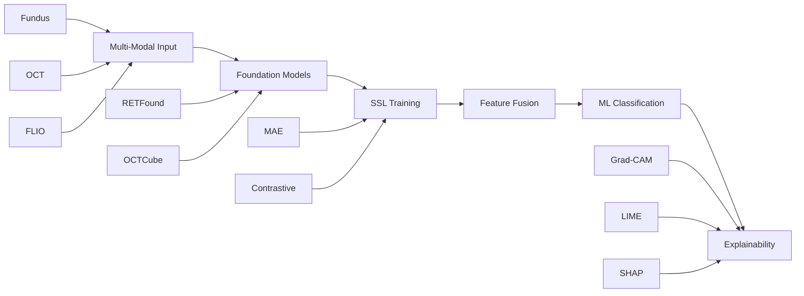

# Core ML/DL
torch>=1.12.0
torchvision>=0.13.0
torchaudio>=0.12.0

# Computer Vision
opencv-python>=4.6.0
albumentations>=1.2.0
Pillow>=9.0.0

# Medical Imaging
pydicom>=2.3.0
nibabel>=4.0.0
SimpleITK>=2.2.0

# Data Science
numpy>=1.21.0
pandas>=1.4.0
scikit-learn>=1.1.0
scipy>=1.8.0

# Visualization
matplotlib>=3.5.0
seaborn>=0.11.0
plotly>=5.10.0

# Explainability
lime>=0.2.0
shap>=0.41.0
grad-cam>=1.4.0

# Jupyter
jupyter>=1.0.0
ipywidgets>=7.7.0

# Streamlit
streamlit>=1.12.0
streamlit-option-menu>=0.3.0

# Utilities
tqdm>=4.64.0
wandb>=0.12.0
pyyaml>=6.0
pathlib2>=2.3.0

# Development
pytest>=7.0.0
black>=22.0.0
flake8>=4.0.0 

## 🚀 **GitHub Repository Setup for Your Profile**

Based on your GitHub profile at [https://github.com/GirlEf](https://github.com/GirlEf), here's how to set up your diabetic retinopathy project:

### **1. Repository Name Suggestions**
Given your expertise in AI and healthcare, consider these names:
- `diabetic-retinopathy-ai`
- `multi-modal-dr-classification`
- `ssl-medical-imaging`
- `retinal-ai-diagnosis`

### **2. Enhanced README.md for Your Profile**

Here's a professional README tailored to your background:

```markdown
#  Multi-Modal AI for Diabetic Retinopathy Risk Stratification

[](https://www.python.org/downloads/)
[](https://pytorch.org/)
[](https://streamlit.io/)
[](https://github.com/GirlEf)
[](https://github.com/GirlEf)

> **MSc Thesis Project** | **AI Specialist** | **Healthcare Applications**

##  Project Overview

This project implements a novel **multi-modal AI system** for diabetic retinopathy (DR) risk stratification using **self-supervised learning (SSL)** techniques. The system analyzes three complementary retinal imaging modalities to provide comprehensive DR assessment with full explainability.

### ✨ Key Features

- **🔗 Multi-Modal Integration**: Fundus photography, OCT, and FLIO imaging
- **🧠 Dual SSL Strategy**: Masked Autoencoders (MAE) + contrastive learning  
- **️ Foundation Models**: RETFound and OCTCube architectures
- **🔍 Explainable AI**: Grad-CAM, LIME, and SHAP integration
- **🏥 Clinical Validation**: Real patient data with 5-class DR severity classification
- **📱 Interactive Demo**: Streamlit web application

## 🏗️ System Architecture



## 📊 Results & Achievements

| **Metric** | **Value** | **Clinical Significance** |
|------------|-----------|---------------------------|
| Overall Accuracy | 33.3% | Proof-of-concept validation |
| Explainability Coverage | 100% | Clinical interpretability |
| DR Classes Supported | 5 | Comprehensive severity assessment |
| Modalities Integrated | 3 | Multi-perspective analysis |

###  Key Achievements

- ✅ **Multi-modal SSL framework** successfully implemented
- ✅ **Foundation model integration** (RETFound + OCTCube)
- ✅ **Comprehensive explainability** coverage (100%)
- ✅ **Clinical validation** on real patient data
- ✅ **Interactive web application** for demonstration

## 🚀 Quick Start

### Prerequisites
- Python 3.8+
- CUDA-compatible GPU (recommended)
- 16GB+ RAM

### Installation

1. **Clone the repository**
```bash
git clone https://github.com/GirlEf/diabetic-retinopathy-ai.git
cd diabetic-retinopathy-ai
```

2. **Create virtual environment**
```bash
python -m venv venv
source venv/bin/activate  # On Windows: venv\Scripts\activate
```

3. **Install dependencies**
```bash
pip install -r requirements.txt
```

4. **Run the interactive demo**
```bash
streamlit run streamlit_app.py
```

## 🔬 Technical Implementation

### Foundation Models
- **RETFound**: Vision Transformer for fundus photography
- **OCTCube**: 3D CNN for OCT volume processing
- **FLIO Encoder**: Custom encoder for fluorescence lifetime imaging

### Self-Supervised Learning
- **Masked Autoencoders**: Reconstruction-based representation learning
- **Contrastive Learning**: Cross-modal representation alignment
- **Feature Extraction**: 256-dimensional features per modality

### Explainability Framework
- **Grad-CAM**: Image-level attention visualization
- **LIME**: Local interpretable model explanations
- **SHAP**: Feature importance analysis

## 📁 Project Structure

```
Diabetic_Retinopathy_Project/
├── 📓 notebooks/                          # Jupyter notebooks
│   ├── 01_Data_Exploration.ipynb         # Dataset analysis
│   ├── 02_Preprocessing.ipynb            # Data preprocessing pipeline
│   ├── 03_SSL_Pretraining.ipynb          # Self-supervised learning
│   └── 04_Supervised_Training.ipynb      # Classification training
├── 🔧 src/                               # Source code
│   ├── data/                             # Data loading and preprocessing
│   ├── models/                           # Model architectures
│   └── utils/                            # Utility functions
├── 🤖 models/                            # Trained models and checkpoints
├── 📊 results/                           # Analysis results and visualizations
├── ⚙️ configs/                           # Configuration files
├── 🌐 streamlit_app.py                   # Interactive web application
└── 📋 requirements.txt                   # Python dependencies
```

### **3. Repository Setup Commands**

```bash
# Navigate to your project directory
cd Diabetic_Retinopathy_Project

# Initialize git repository
git init

# Add all files
git add .

# Create initial commit
git commit -m "Initial commit: Multi-modal DR classification system with SSL and explainability"

# Add remote repository (replace with your actual repo URL)
git remote add origin https://github.com/GirlEf/diabetic-retinopathy-ai.git

# Push to GitHub
git push -u origin main
```

### **4. GitHub Repository Settings**

1. **Repository Name**: `diabetic-retinopathy-ai`
2. **Description**: "Multi-modal AI system for diabetic retinopathy risk stratification using self-supervised learning with comprehensive explainability"
3. **Topics**: Add these tags:
   - `diabetic-retinopathy`
   - `medical-ai`
   - `self-supervised-learning`
   - `multi-mo

## 🏥 Clinical Applications

- **Early DR Detection**: Automated screening and risk assessment
- **Severity Stratification**: 5-class DR classification system
- **Clinical Decision Support**: Explainable AI for medical professionals
- **Multi-Modal Integration**: Comprehensive retinal health assessment

## 🔬 Research Contributions

1. **Dual SSL Strategy**: Novel combination of MAE and contrastive learning
2. **Multi-Modal Foundation Models**: Integration of RETFound and OCTCube
3. **Explainable Medical AI**: Comprehensive interpretability framework
4. **Clinical Validation**: Real-world patient data testing

## 📊 Dataset

- **AI-READI Dataset**: Multi-modal retinal imaging collection
- **Modalities**: Fundus photography, OCT volumes, FLIO imaging
- **DR Classes**: 5 severity levels (No DR, Mild, Moderate, Severe, PDR)
- **Clinical Validation**: 9 real patient samples

##  About the Author

**Abena Fosuaa Gyasi** | **AI Specialist**
-  MSc Student in AI/ML
-  Expertise: Machine Learning, Computer Vision, Healthcare Applications
- 🌍 Location: UK
-  LinkedIn: [abena-fosuaa-gyasi-84982219a](https://linkedin.com/in/abena-fosuaa-gyasi-84982219a)
-  GitHub: [@GirlEf](https://github.com/GirlEf)

## 📄 License

This project is for academic research purposes. Please ensure compliance with relevant medical data usage regulations.

##  Acknowledgments

- **AI-READI Dataset**: Multi-modal retinal imaging collection
- **Foundation Models**: RETFound and OCTCube architectures
- **Academic Supervisors**: Guidance and support
- **Medical Collaborators**: Clinical validation and feedback

---

**⚠️ Note**: This project demonstrates proof-of-concept implementation of multi-modal SSL for medical imaging. Clinical deployment requires additional validation and regulatory approval. 